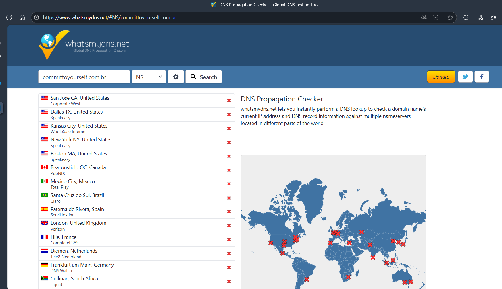

# Guia de Estudos: DNS (Domain Name System)

Este documento registra meus estudos sobre o funcionamento do DNS, desde os conceitos básicos até o processo de registro e configuração.

## 1. O que é DNS?

O Domain Name System (Sistema de Nomes de Domínio) é a lista telefônica da internet. Sua função principal é converter um nome de domínio legível por humanos (como `google.com`) no endereço de IP do servidor onde o site está hospedado (como `142.251.132.78`).

> **Analogia:** DNS são "apelidos" para endereços de IP. Os IPs são os endereços reais e únicos que os computadores usam para se comunicar, mas são difíceis de memorizar.

**O fluxo básico:**

1.  Um usuário (em seu computador) digita um domínio no navegador.
2.  O computador envia esse domínio para um servidor DNS.
3.  O servidor DNS descobre e devolve o IP correto para o computador.
4.  O computador usa esse IP para contatar o servidor final e carregar a página.

---

## 2. O Processo de Resolução de DNS (O Caminho Real)

O "fluxo básico" é uma simplificação. O processo real é mais complexo e envolve múltiplos servidores em uma hierarquia.

**O fluxo detalhado:**

1.  **Cliente -> Recursive Resolver:** O computador envia a solicitação para o **Recursive Resolver** (geralmente fornecido pelo seu provedor de internet, como Vivo, Claro, etc.). O Resolver é o "agente" encarregado de descobrir o IP.

2.  **Recursive Resolver -> Root Servers:** O Resolver entra em contato com um dos 13 **Root Servers** (Servidores Raiz) espalhados pelo mundo. Esses servidores têm IPs fixos e conhecidos, sendo o ponto de partida de toda a busca.

    - O Root Server não sabe o IP final. Ele lê o domínio de trás para frente (ex: `meusite.com.br.`).

3.  **Root Servers -> TLD Servers:** O Root Server identifica o **TLD (Top-Level Domain)** — por exemplo, o `.br` — e responde ao Resolver com a lista de IPs dos servidores TLD responsáveis por todos os domínios `.br`.

4.  **Recursive Resolver -> TLD Servers:** O Resolver, de posse dessa nova lista, pergunta ao servidor TLD (neste caso, o servidor que gerencia o `.br`) qual é o IP do domínio `meusite.com.br`.

5.  **TLD Servers -> Authoritative Server:** O servidor TLD não sabe o IP final, mas ele sabe quem é o responsável oficial pelo domínio: o **Authoritative Server** (Servidor de Autoridade). Ele responde ao Resolver com o IP desse servidor de autoridade.

6.  **Recursive Resolver -> Authoritative Server:** O Resolver faz, finalmente, a pergunta ao Authoritative Server. Este servidor é o que guarda todos os registros DNS (Records) do domínio e é a fonte final da verdade.

7.  **Authoritative Server -> Recursive Resolver:** O Authoritative Server responde com o IP final do servidor onde a página está hospedada.

8.  **Recursive Resolver -> Cliente:** O Resolver entrega o IP final ao nosso computador, que pode, enfim, acessar a página.

### Conceitos-Chave no Caminho

- **FQDN (Fully Qualified Domain Name):** É o nome de domínio completo, que tecnicamente termina com um ponto final (`.`) oculto (ex: `www.google.com.`). Esse ponto representa o **Root Domain**, por onde a busca se inicia nos Root Servers.
- **TLD (Top-Level Domain):** É a última parte do domínio (`.com`, `.br`, `.org`).
  - **ccTLDs (Country Code TLDs):** Reservados para países (`.br` para Brasil, `.pt` para Portugal).
  - **gTLDs (Generic TLDs):** Domínios genéricos (`.com`, `.org`, `.net`, `.dev`, etc.).

---

## 3. Cache e TTL (Time To Live)

Para evitar que esse processo completo de 8 etapas ocorra a cada milissegundo, sobrecarregando os servidores, é usado um sistema de cache.

- **TTL (Time To Live):** É uma configuração (em segundos) definida no Authoritative Server para cada registro DNS.
- O TTL informa ao Recursive Resolver por quanto tempo ele deve armazenar (manter em cache) a resposta (o IP) antes de perguntar tudo de novo.
- Um TTL de 3600 (1 hora), por exemplo, faz com que qualquer pessoa usando aquele provedor de internet receba a resposta em cache por 1 hora, tornando o acesso quase instantâneo.

---

## 4. Propagação de DNS

Uma consequência direta do cache (TTL) é a **propagação de DNS**.

Quando um registro DNS é alterado (ex: você muda seu site de um servidor para outro, alterando o IP), essa mudança não é instantânea para o mundo todo.

Os Recursive Resolvers que já tinham a informação antiga em cache (antes da mudança) só verão a nova informação depois que o TTL expirar. Isso é chamado de "tempo de propagação". Ferramentas como o `whatsmydns.net` são usadas para verificar como essa propagação está ocorrendo em diferentes partes do mundo.

_Legenda: Verificando a propagação de um registro DNS em diferentes servidores ao redor do mundo antes da sua configuração._

---

## 5. Como um Domínio é Registrado

Para que um domínio exista e possa ser encontrado, ele precisa ser registrado.

1.  **Registrar (Revendedor):** Você registra seu domínio através de um **Registrar**, que é uma empresa autorizada a vender nomes de domínio (ex: Registro.br, GoDaddy, HostGator, etc.).
2.  **Registry (Cartório):** O Registrar comunica esse registro ao **Registry**, que é a entidade central que gerencia um TLD específico.
    - No Brasil, o Registry do `.br` é o **NIC.br** (Núcleo de Informação e Coordenação do .br).
3.  **Atualização do TLD:** O Registry (NIC.br) atualiza seus servidores TLD (que gerenciam o `.br`) para informar ao mundo quais são os Authoritative Servers do seu novo domínio.
4.  **Configuração Inicial:** Por padrão, ao criar um domínio (ex: no Registro.br), ele cria automaticamente um Authoritative Server básico. O próximo passo é configurar os registros DNS nesse servidor para apontar para os serviços desejados (seu site, seu e-mail, etc.).

---

## 6. Próximos Passos: Tipos de Registros DNS (Records)

Esta é a parte prática da configuração no Authoritative Server. Cada registro tem uma função específica.

### A Record (Address)

- **Função:** [PENDENTE - Adicionar detalhes]
- **Exemplo:** `meusite.com.br` -> `192.0.2.1`

### AAAA Record (IPv6 Address)

- **Função:** [PENDENTE - Adicionar detalhes]
- **Exemplo:** `meusite.com.br` -> `2001:0db8:85a3:0000:0000:8a2e:0370:7334`

### CNAME Record (Canonical Name)

- **Função:** [PENDENTE - Adicionar detalhes]
- **Exemplo:** `www.meusite.com.br` -> `meusite.com.br`

### MX Record (Mail Exchange)

- **Função:** [PENDENTE - Adicionar detalhes]
- **Exemplo:** `meusite.com.br` -> `mail.provedor.com`

### TXT Record (Text)

- **Função:** [PENDENTE - Adicionar detalhes]
- **Exemplo:** Usado para verificação de domínio (Google, Microsoft 365), SPF, DKIM, etc.

---

## 7. Notas para o Tutorial do LinkedIn

Para transformar este estudo em um artigo/tutorial prático e relevante para sua busca de emprego (como dev backend):

- **Foco Prático:** Em vez de focar apenas na teoria, mostre a prática. Um bom tutorial seria: "Como registrar um domínio no Registro.br e apontá-lo para uma aplicação (ex: um app Node.js) hospedada na nuvem (AWS, Azure, Vercel, etc.)".
- **Tutorial de Configuração:** Demonstre a configuração dos registros `A` e `CNAME`. Essa é uma tarefa de backend/DevOps muito comum.
  - _Exemplo:_ Como fazer o domínio `meusite.com.br` (Record A) e o subdomínio `www.meusite.com.br` (Record CNAME) apontarem para o mesmo lugar.
- **Use a Imagem:** Use a imagem do `whatsmydns.net` para mostrar o "antes" (servidores antigos) e o "depois" (servidores novos) ao migrar um site, explicando o TTL.
